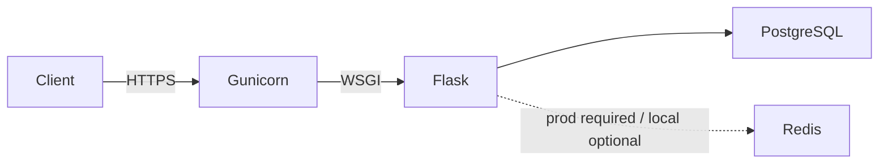

# AccessVault

REST API for user management with JWT authentication and role-based access control (user/admin). Built with Flask, PostgreSQL, and optional Redis.

### Demo

| Link | URL |
|------|-----|
| API | [https://accessvault-api-8shv.onrender.com/](https://accessvault-api-8shv.onrender.com/) |
| Health | [https://accessvault-api-8shv.onrender.com/api/health/](https://accessvault-api-8shv.onrender.com/api/health/) |
| Swagger UI | [https://accessvault-api-8shv.onrender.com/api/swagger-ui/](https://accessvault-api-8shv.onrender.com/api/swagger-ui/) |

Hosted on Render’s free tier (cold starts after idle). To deploy your own copy, see [DEPLOYMENT.md](DEPLOYMENT.md). Security and improvement plan: [ROADMAP.md](ROADMAP.md).

---

### Features

- JWT access/refresh tokens with Redis-backed logout/token revocation in production (in-memory blocklist for local development)
- Roles: `user` and `admin`
- Rate limiting, CORS, bcrypt password hashing
- Health checks and Swagger UI (Flask-RESTX)
- Structured request logging

**Stack:** Flask · PostgreSQL · Gunicorn · Redis · Flask-JWT-Extended · Flask-RESTX  

Redis is required for production rate limiting and token revocation; local development can use in-memory fallbacks.

---

## Architecture



---

## Project layout

- **`app/`** — routes (health, auth, profile, admin), models, config, extensions, decorators, logger
- **`scripts/`** — `init_db`, `create_admin`
- **`run.py`** — local entry point (production: `gunicorn app:app`)

---

## Quick start

```bash
git clone https://github.com/bannuru-veerendra/access-vault.git
cd access-vault
pip install -r requirements.txt
```

Copy [.env.example](.env.example) to `.env` and set at least `SQLALCHEMY_DATABASE_URI`, `SECRET_KEY`, and `JWT_SECRET_KEY`. Optionally set `RATELIMIT_STORAGE_URL`, `BLOCKLIST_REDIS_URL`, and `CORS_ORIGINS`.

```bash
python -m scripts.init_db
python -m scripts.create_admin   # optional
python run.py
```

- API: `http://127.0.0.1:5000/`
- Health: `http://127.0.0.1:5000/api/health/`
- Swagger: `http://127.0.0.1:5000/api/swagger-ui/`

---

## API docs

Endpoint reference: [API.md](API.md). Base path: `/api`.

---

## Testing

```bash
pip install -r requirements.txt
pytest
```

Uses SQLite in-memory (no Postgres/Redis needed). Postman collections remain useful for manual API exploration.

---

**Bannuru Veerendra** — [GitHub](https://github.com/bannuru-veerendra) · [LinkedIn](https://www.linkedin.com/in/veerendra-bannuru-900934215) · [Email](mailto:bannuru.veerendra@gmail.com)
