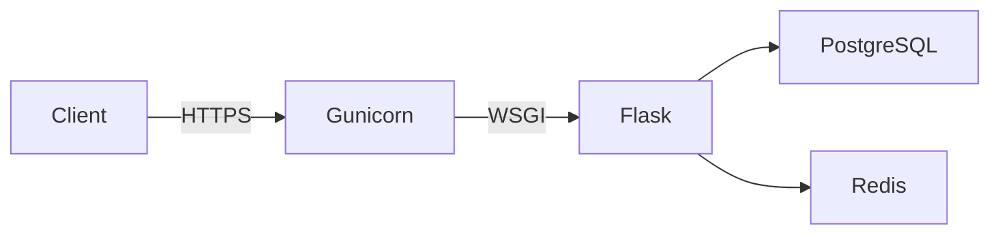

# AccessVault - Enterprise User Management API

AccessVault is a **production-ready REST API** that provides secure user management capabilities for modern web applications. It's designed with enterprise security standards and includes features like JWT authentication, role-based access control, rate limiting, and comprehensive audit logging.

### **Live API**

| Link           | URL                                                                                                                    |
|----------------|------------------------------------------------------------------------------------------------------------------------|
| **Live API**   | [https://accessvault-api-8shv.onrender.com/](https://accessvault-api-8shv.onrender.com/)                               |
| **Health**     | [https://accessvault-api-8shv.onrender.com/api/health/](https://accessvault-api-8shv.onrender.com/api/health/)         |
| **Swagger UI** | [https://accessvault-api-8shv.onrender.com/api/swagger-ui/](https://accessvault-api-8shv.onrender.com/api/swagger-ui/) |

**Deploy your own:** see **[DEPLOYMENT.md](DEPLOYMENT.md)** for a step-by-step guide (Render + GitHub + environment variables).

---

### **Production Usage**

- **Deployed on:** Render
- Used for **demo/testing** by multiple users
- Handles **hundreds of API requests** daily
- Maintains **high availability** during active periods

---

### **Key Features**

JWT Auth · RBAC (user/admin) · Rate limiting & blocklist (Redis/memory) · CORS · Token rotation · Bcrypt · Swagger UI · Health checks · Structured logging

**Tech stack:** Flask, PostgreSQL, Gunicorn, Redis (optional), Flask-RESTX, JWT-Extended

---

## **System Design**



---

## **Project Layout**

- **`app/`**
  - routes: health, auth, profile, admin
  - models, config, extensions, decorators, logger
- **`scripts/`**
  - init_db
  - create_admin
- **`run.py`** — local entry point (production: `gunicorn app:app`)

---

## **Quick Start**

```bash
git clone https://github.com/mr-veeru/AccessVault.git
cd AccessVault
pip install -r requirements.txt
```

Create `.env` from [.env.example](.env.example): `SQLALCHEMY_DATABASE_URI`, `SECRET_KEY`, `JWT_SECRET_KEY` (optional: `RATELIMIT_STORAGE_URL`, `CORS_ORIGINS`).

```bash
python -m scripts.init_db
python -m scripts.create_admin   # optional
python run.py
```

**Access Points:**
- **API Base URL:** `http://127.0.0.1:5000/`
- **Health Check:** `http://127.0.0.1:5000/api/health/`
- **Swagger UI:** `http://127.0.0.1:5000/api/swagger-ui/`

---

## **API Documentation**

Complete API documentation is available in **[API.md](API.md)**.
**API Base URL:** `http://127.0.0.1:5000/api`

---

## **Testing**

**Testing is done in Postman** — collections for auth, profile, admin; env vars for base URL and tokens.

---

## **What This Project Demonstrates**

- Designing **secure authentication systems**
- Building **scalable REST APIs**
- Integrating **Redis** and **PostgreSQL**
- Deploying **Flask apps** to cloud platforms
- Writing **production-quality documentation**

---

**Bannuru Veerendra** — [GitHub](https://github.com/bannuru-veerendra) · [LinkedIn](https://www.linkedin.com/in/veerendra-bannuru-900934215) · [Email](mailto:bannuru.veerendra@gmail.com)
